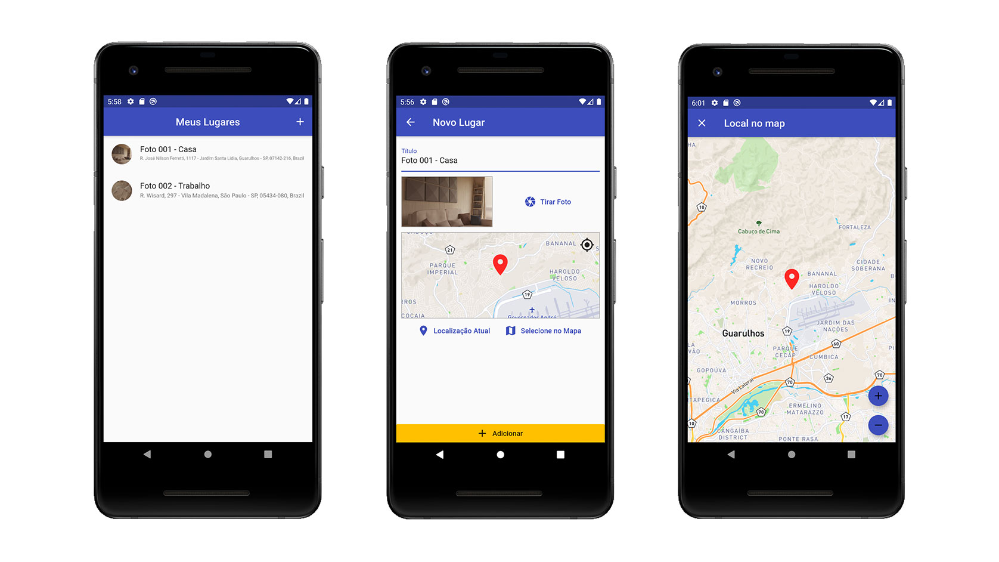

# 📱 app_greatplaces

## :memo: Sobre o Projeto 
### Português: 
Um projeto fictício apenas para estudo de flutter, com foco em dependência API de mapas e recursos do dispositivo. 
Um aplicativo de registrar fotos junto de seus locais.

### Inglês: 
A fictitious project just to study flutter, focused on API dependence on maps and device features. 
An application to register photos with your locations.